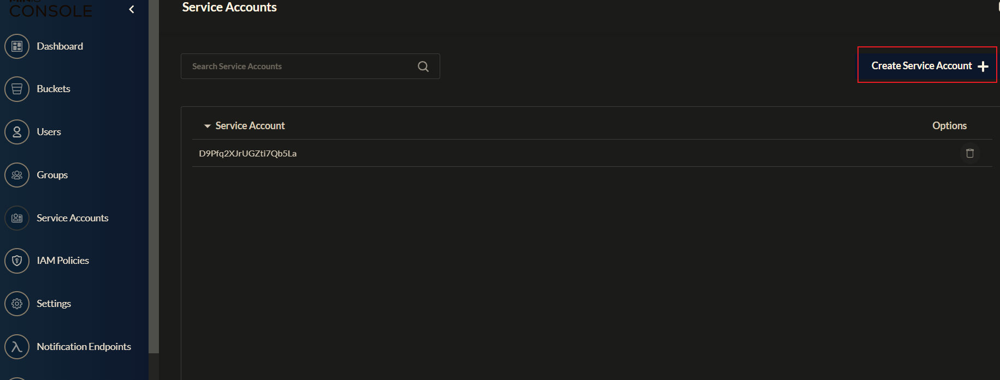

## 安装

### 通过 1panel 快速安装 minio (略)

### 使用! [image-20240617162518125](

##### 创建桶


##### 设置为公开, 私有无法访问

##### 

##### 配置访问规则, 前缀


##### 创建服务账号




##### 代码中使用


## 2.通过 Docker 自己安装

```sh
docker pull docker://minio/minio # 拉取minio镜像
```


