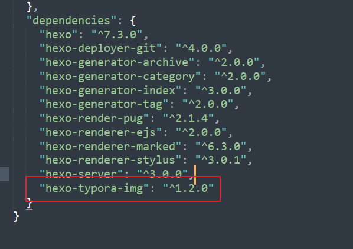
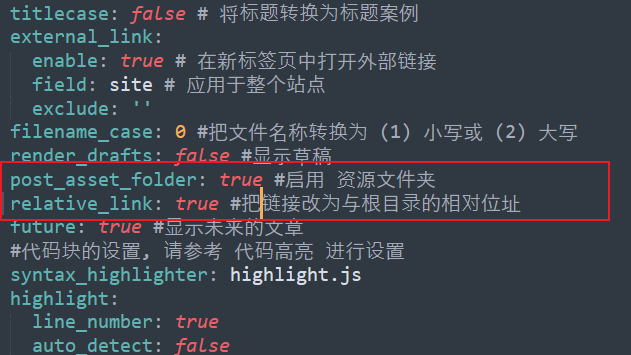
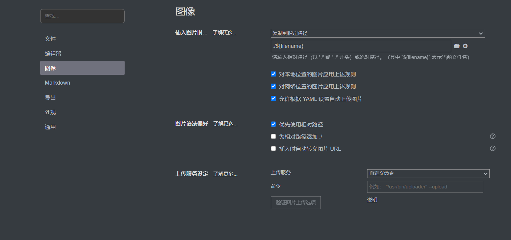

**[Hexo 官网](https://hexo.io/zh-cn/)**

**Question :** 

​	hexo 处理 本地编写的带有图片的markdown时, 无法正确加载图片的路径

**Solution :**

1. 安装插件 `hexo-typora-img`

   

   ```bash
   npm install hexo-typora-img --save
   ```

   

2. 修改_config.yml

   

   ```yml
   post_asset_folder: true #启用 资源文件夹
   relative_link: true #把链接改为与根目录的相对位址
   ```

   

3. 修改typora图片配置


