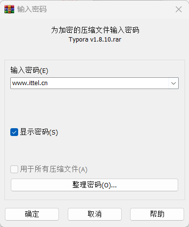
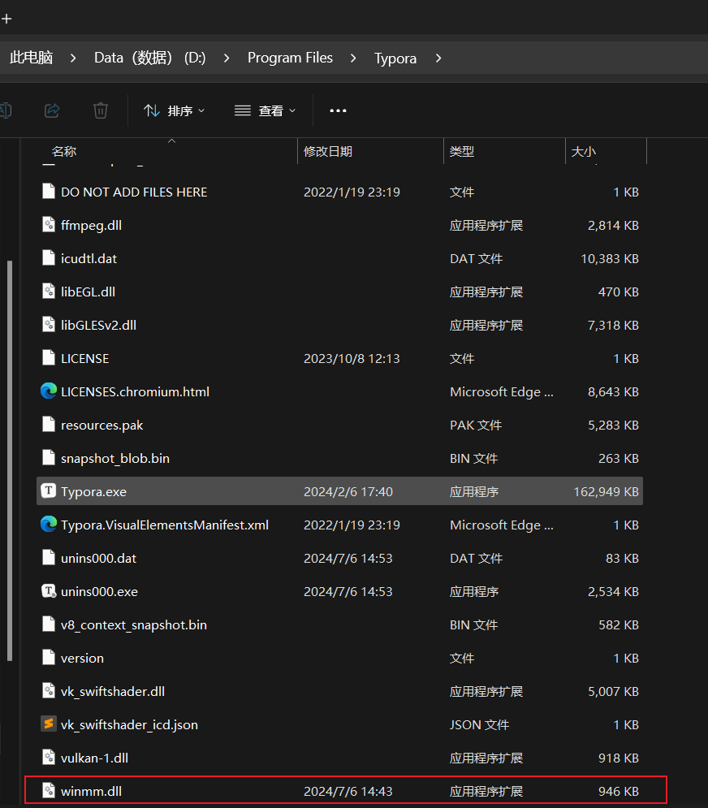
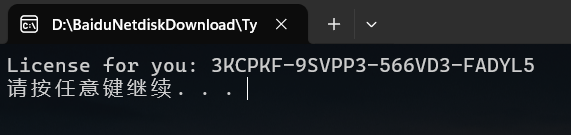
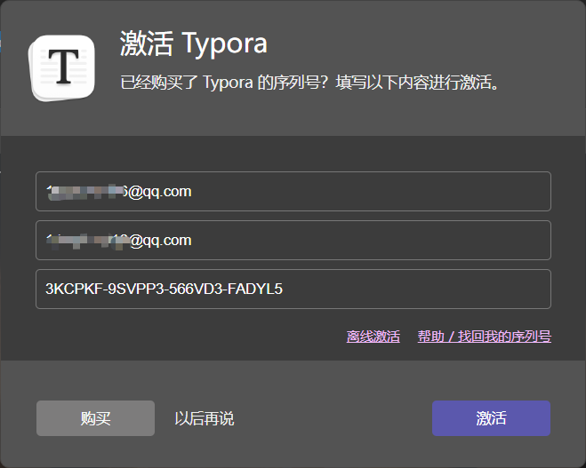

[TOC]


## Download

[ 👉百度网盘下载 ](https://pan.baidu.com/share/init?surl=AXfxqM9KBSp7fvbpkeQ8KA&pwd=9sla)

## 解压

**解压密码**

```
www.ittel.cn
```



## 安装


## 激活

### 方式1 (亲测可行)

将 `ittel/winmm.dll` 复制到Typora安装目录下


 

最后重启 查看许可证


### 方式2  (我不行)

How to use?

1. 运行 typora-setup-x64-1.7.0-dev-cracked.exe 安装Typora

2. 运行 LicenseGen.exe 获得激活码

   

3. 输入你的邮箱和得到的激活码

   

4. 完美激活！

这里也提供几个可以用的激活码

```
VMLM7G-2A45QN-DBM3UZ-GSC7U3
NXYAC8-NQLVG3-4ZMB4Z-W4APQA
7UMJ6D-BWHGKL-KD7ZN9-DNFA3E
6TFNEN-EFC3MK-QC5VC7-XHWY6A
```


