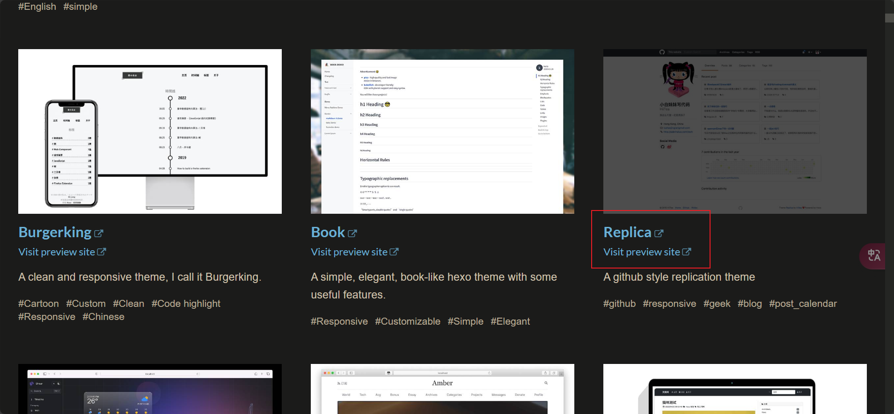
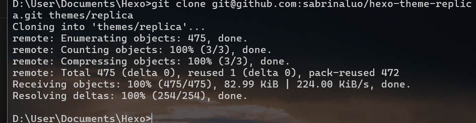
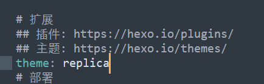

`千里之行，始于足下。`

[Themes | Hexo](https://hexo.io/themes/)

# 选择主题

可以预览 , 和 查看源码



## 安装

```java
git clone git@github.com:sabrinaluo/hexo-theme-replica.git themes/replica
```



主题将 安装在 themes/主题名 

### 修改_config.yml



备份主题配置

 [_config.yml](..\..\..\..\themes\replica\_config.yml)  -> [_config - 副本.yml](..\..\..\..\themes\replica\_config - 副本.yml) 

修改配置 [_config.yml](..\..\..\..\themes\replica\_config.yml) 

