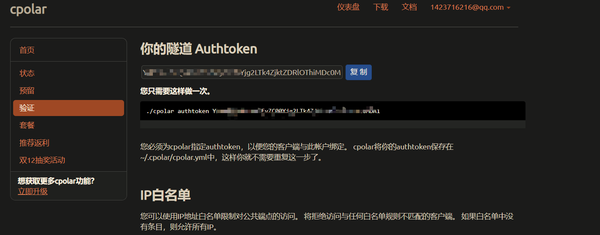

`千里之行，始于足下。`

[cpolar - secure introspectable tunnels to localhost](https://dashboard.cpolar.com/)


**优点**: 不限流量 , 4 条隧道

**缺点**: CPU 占用高 , 随机 IP


# 安装

```
curl -L https://www.cpolar.com/static/downloads/install-release-cpolar.sh | sudo bash

```


### 查看版本

```java
inyxin@beelink:~$ cpolar version
cpolar version 3.3.12
```

### token 认证

登录 [cpolar 官网后台](https://dashboard.cpolar.com/get-started)，点击左侧的验证，查看自己的认证 token，之后将 token 贴在命令行里



```bash
inyxin@beelink:~$ cpolar authtoken YWVmMDQ0NGEtMTEyZC00Yjg2LTk4ZjktZDRlOThi
Authtoken saved to configuration file: /usr/local/etc/cpolar/cpolar.yml
```

### 简单穿透测试一下

```java
cpolar 9998
    cpolar by @bestexpresser                                    (Ctrl+C to quit)                                                                            Tunnel Status       online
Account             inyxin (Plan: Free)
Version             3.12/3.22
Web Interface       127.0.0.1:4040
Forwarding          http://31526c8c.r25.cpolar.top -> http://localhost: 9998 Forwarding          https://31526c8c.r25.cpolar.top -> http://localhost: 9998# Conn              0
Avg Conn Time       0.00ms                                 
    
    
```

穿透成功 , 只是 IP 不固定

```java
https://31526c8c.r25.cpolar.top/#/
```

