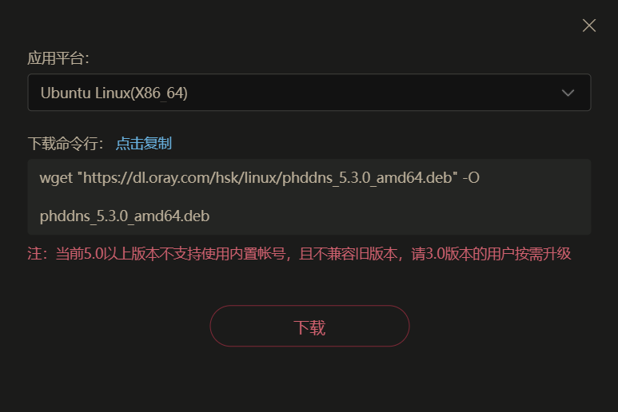
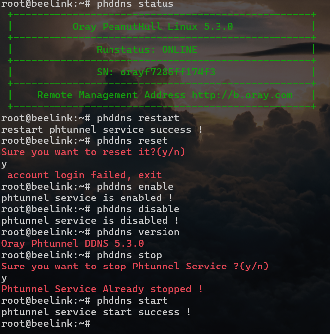
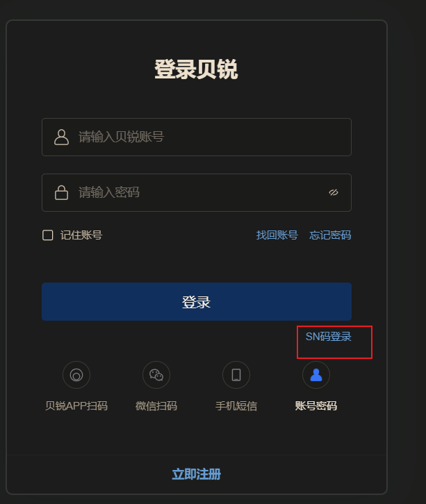
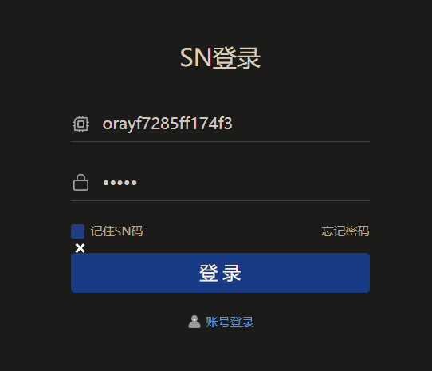
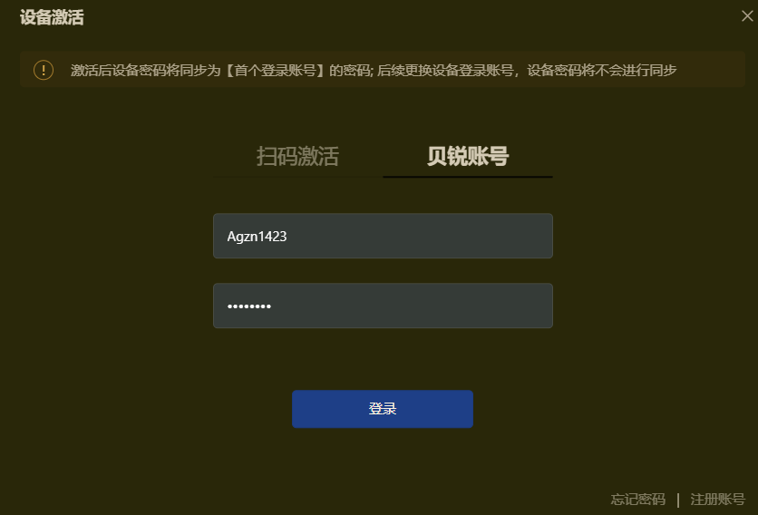
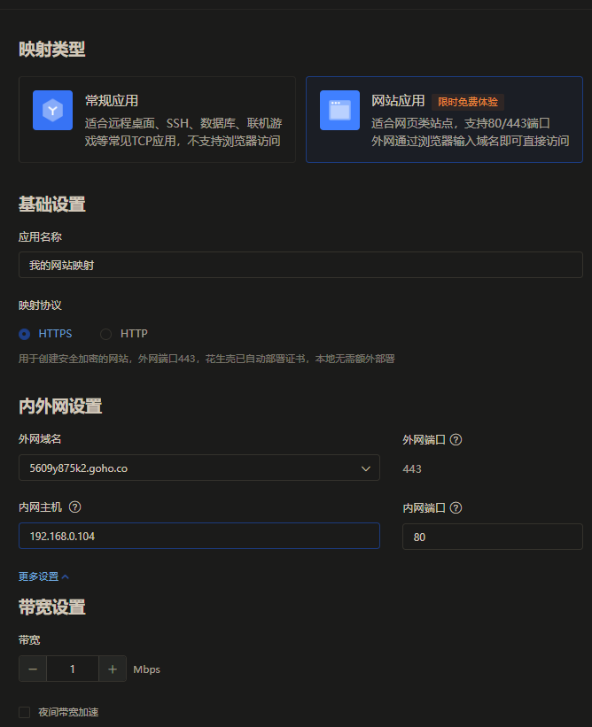
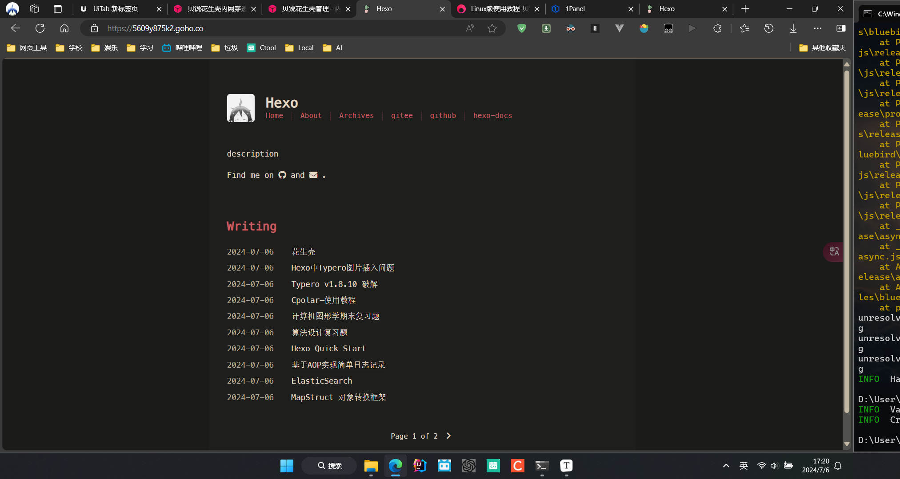

`千里之行，始于足下。`

[花生壳客户端官方下载 - 贝锐花生壳官网 (oray.com)](https://hsk.oray.com/download)

优点: 固定IP

缺点: 限流1M , 只有2条隧道

# 下载



```bash
wget "https://dl.oray.com/hsk/linux/phddns_5.3.0_amd64.deb" -O phddns_5.3.0_amd64.deb
```

[Linux版使用教程-贝锐官网 (oray.com)](https://service.oray.com/question/11630.html)

# 安装

```bash
root@beelink:~# apt install ./phddns_5.3.0_amd64.deb
正在读取软件包列表... 完成
正在分析软件包的依赖关系树... 完成
正在读取状态信息... 完成
注意，选中 'phddns' 而非 './phddns_5.3.0_amd64.deb'
下列【新】软件包将被安装：
  phddns
升级了 0 个软件包，新安装了 1 个软件包，要卸载 0 个软件包，有 48 个软件包未 被升级。
需要下载 0 B/270 kB 的归档。
解压缩后会消耗 12.5 MB 的额外空间。
获取:1 /root/phddns_5.3.0_amd64.deb phddns amd64 5.3.0 [270 kB]
正在选中未选择的软件包 phddns。
(正在读取数据库 ... 系统当前共安装有 224640 个文件和目录。)
准备解压 /root/phddns_5.3.0_amd64.deb  ...
正在解压 phddns (5.3.0) ...
正在设置 phddns (5.3.0) ...
in systemv
Installation, please later...
Successful installation of Phddns Service.

 +--------------------------------------------------+
 |             Oray PeanutHull Linux 5.3.0          |
 +--------------------------------------------------+
 |  SN: orayf7285ff174f3   Default password: admin  |
 +--------------------------------------------------+
 |    Remote Management Address http://b.oray.com   |
 +--------------------------------------------------+
N: 由于文件'/root/phddns_5.3.0_amd64.deb'无法被用户'_apt'访问，已脱离沙盒并 提权为根用户来进行下载。 - pkgAcquire::Run (13: 权限不够)
root@beelink:~#
```

### 卸载

```bash
root@beelink:~# apt remove phddns
正在读取软件包列表... 完成
正在分析软件包的依赖关系树... 完成
正在读取状态信息... 完成
下列软件包将被【卸载】：
  phddns
升级了 0 个软件包，新安装了 0 个软件包，要卸载 1 个软件包，有 48 个软件包未 被升级。
解压缩后将会空出 12.5 MB 的空间。
您希望继续执行吗？ [Y/n] y
(正在读取数据库 ... 系统当前共安装有 224651 个文件和目录。)
正在卸载 phddns (5.3.0) ...
phdaemon: 未找到进程
phtunnel: 未找到进程
phddns_mini_httpd: 未找到进程
Remove Phtunnel Service Success.
Thanks For Using Phtunnel Service.
root@beelink:~#
```

# 扩展功能

```bash
root@beelink:~# phddns
Phtunnel Serive called with  unknown argument
(phddns  |start|status|stop|restart|reset|enable|disable|version)
```

- start 启动
- stop 停止
- status 状态
- restart 重启
- reset 重置
- enable 开机自启
- disable 取消开机自启
- version 查看版本号

**注意: 除phddns version命令不需要管理员权限外,其他命令均需要管理员权限**



# 使用

1、浏览器访问[http://b.oray.com](http://b.oray.com/) ，输入花生壳Linux 5.0在安装时产生**SN码与默认登录密码admin**登录。







激活成功后就可以正常使用了

# 添加映射

| 选项                                 | 描述                                                         |
| ------------------------------------ | ------------------------------------------------------------ |
| 应用名称                             | 自定义                                                       |
| 应用图标                             | 自行选择                                                     |
| 映射类型                             | 选择TCP                                                      |
| 映射模板                             | 暂不选择模板                                                 |
| 外网[域名](https://domain.oray.com/) | 选择用作外网访问的域名                                       |
| 外网端口                             | 选择动态端口                                                 |
| 内网主机                             | 映射的Ubuntu系统内网IP地址                                   |
| 内网端口                             | 映射的服务类型对应端口22                                     |
| 访问控制                             | 设置在指定条件下才可访问映射 , 提升应用安全。针对网页类映射可支持设置访问密码 |
| 带宽                                 | 购买映射带宽后，可支持给映射分配额外带宽，这里保存默认       |
| 夜间带宽                             | 18:00-次日8:00带宽速度提升100%，速度不低于5Mbps；带宽基数越大，夜间越快 |

[贝锐花生壳管理 - 内网穿透 (oray.com)](https://console.hsk.oray.com/forward)



**内网主机** : 127.0.0.1也行

访问部署在linux 80 端口上的nginx 



穿透成功