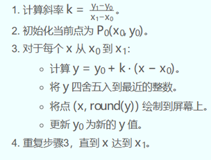
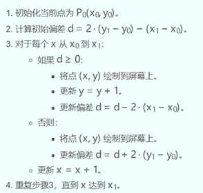
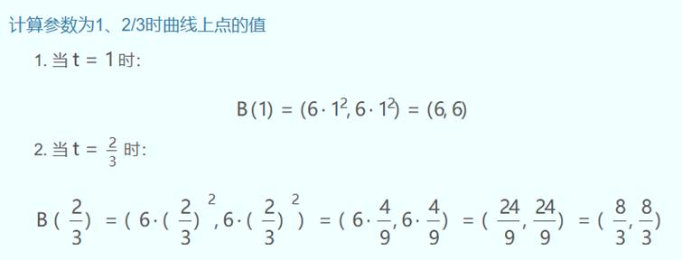
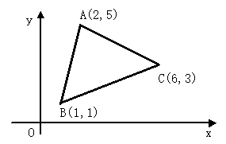
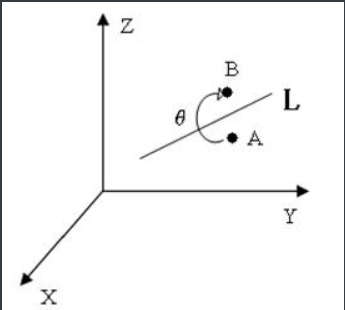
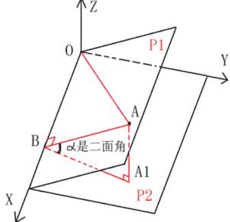
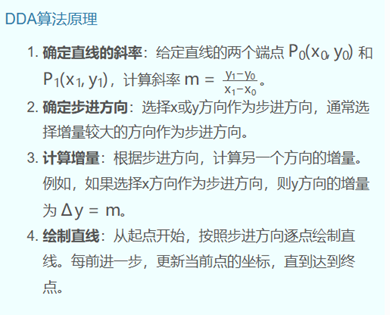
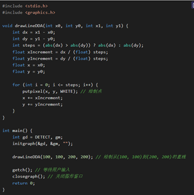
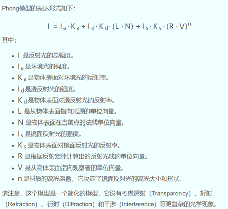

**单项选择题：**

1．计算机的最小存储单位是   A    。

  A． 位  B． 字节   C． 字  D． 双字 

2．关于计算机图形学研究内容，不正确的说法是    D 。

  A． 几何模型构造及图形生成技术       B． 图形的操作与处理方法  

C． 图形信息的存储、检索与交换技术   D． 人机交互及用户串联技术

3. C/C++ Windows 应用程序的入口函数名称是    B   。

A． main    B． WinMain    C． mian     D． winMain

4. 本学期的计算机图形学课程选用的编程语言是   A   。

A． C/C++      B． Java     C． C#      D． Python

5. 以下属于本课程选用的编程语言的特点是   B    。

A． 不支持多继承    B．执行效率高    

C． 需要解释执行    D． 不适合编写系统软件

6. 在Win32 Application平台上绘制图形的类型是   A   。

A． HDC      B．DCC      C．PDC       D．CDD

7. 本学期本课程介绍的绘制直线段的算法共有    D  种。

A． 1      B． 2      C． 3       D． 4

8．平面直角坐标系的第一象限有两点A（x0,y0）、B（x1,y1），其中x0、y0、x1、y1均是正整数，则用逐点比较法绘制直线段AB共需执行   A  次画点命令。

A. | x1-x0| + | y1-y0| + 1    B. | x1-x0| + | y1-y0| 

C. | x1-x0| + | y1-y0| - 1     D. 无法确定

9．若用逐点比较法在平面直角坐标系的第一象限内绘制直线段，则需要该线段的斜率K的绝对值   A   。

A. ≥0  B. ≥1  C. 没有要求  D. 无法确定

10．在平面直角坐标系的第一象限内绘制直线段，下列  D   算法对线段的斜率K没有限制。

A. 逐点比较  B. DDA  C. 中点 D. Bresenham

11．不属于Bresenham算法绘制直线段效率高的原因是    D   。

A. 斜率K不大于1  B. 减少了绘制次数  C. 避免了浮点数运用算 D. 不可进行移位运算

12．采用Bresenham算法绘制从点A（10,10）到点B（20,15）的直线段，共需执行 A     次画点命令。

A. 11  B. 15  C. 10  D. 12

13．计算机图形学中表达一条曲线的方程一般有    C   种形式。

A. 一  B. 二  C. 三 D. 无穷

14．解算三次样条插值函数需要额外补充    B   个条件。

   A. 1  B. 2  C. 3 D. 0

15．下列不属于曲线插值方法的是  D     。

A.多项式插值 B.分段多项式插值 C.样条函数插值 D.最小二乘插值

16．最小二乘法曲线拟合的原理是：使型值点的坐标值与曲线上对应点的坐标值的偏差的平方和达到     B  。

A.最大  B.最小  C.给定的取值范围 D.以上说法均不正确

17．区域内部点的判断方法可以是：射线法、检验夹角之和

18．    B   不属于简单种子填充算法的特点。

A.操作过程简单  B.需进行深度递归  C.算法的效率低 D.仅需少量的内存空间

19．二维图形的几何变换共有   B   种基本变换形式。

A． 2     B． 3     C． 5      D． 4

20．对于任意一条直线段，它相对于一个已定义的窗口位置关系最多有   D   种情况。

A． 2     B． 3     C． 5      D． 4

21．编码裁剪法中，每个区域用一个    D  位代码来表示。

A． 2     B． 3     C． 5      D． 4

22．编码裁剪法中，每个点的编码从高到低位依次分别代表   A   。

A．上下右左     B．右左上下    C．上下左右     D．下上左右

23．编码裁剪法中，每位的编码只有    A  状态。

A． 1    B． 3     C． 2      D． 4

24．编码裁剪法中，若线段两端点编码均为零，则两点    A  。

A．在窗口外    B．在窗口内    C． 不可见      D． 不能确定

25．要判断两端点所构成的线段与窗口对应关系，可用两个端点编码进行  C   运算。

A．逻辑“非”    B．逻辑“或”    C．逻辑“与”      D．逻辑“异或”

26．若线段两端点的编码的逻辑   C  不为0，则这两个端点必然位于某条边界的同侧，故必在窗口外，应不可见。

A．非    B． 或    C． 与       D． 异或

27．多边形的逐边裁剪算法中需要设置   C   个顶点表。

A． 1    B． 3     C． 2      D． 4

28．计算机图形学中，一般有   B   种表示三维图形的方法。

A． 1    B． 3     C． 2      D． 4 (线框模型、表面模型、实体模型)

29．在三维空间里，给定(n＋l)×(m+1)个空间点,可生成   D   次Bezier曲面。

A． (n＋l)×(m+1)    B． n ×(m+1)     C．(n＋l)×m      D． n×m

30．在三维空间中，,生成双三次Bezier曲面，需要    B  个控制顶点。

A． 9    B． 16     C．25      D． 20

31．以下不属于正轴测投影的是   D   。

A． 正等测    B． 正二测    C．正三测      D．正四测

32. 透视投影是透视变换与   A   的组合。

A．平行投影变换    B． 正二测    C．正三测      D．正四测

33. 影响真实感图形因素有   D   。

A．物体本身形状及物体表面特征  B．照射物体光源及物体与光源相对位置

C. 物体周围环境        D. 以上都是

34. 光照在物体表面上通常有   C    种情况。

A． 1      B． 2      C． 3       D． 4

35. Lambert光照模型主要考虑漫反射光和   A   的影响。

A. 环境光      B． 镜面光     C． 透射光       D． 高光

36. Phong光照模型有  C    种类型的光的影响。

A． 1      B． 2      C． 3       D． 4

37．下列有关投影的叙述语句中,正确的论述为    D  。

A. 透视投影与平行投影相比，能真实地反映物体的精确的尺寸和形状

B. 平行投影的投影中心到投影面的距离是无限的

C. 透视投影变换中，一组平行于投影面的线的投影产生一个灭点

D. 灭点可以看作是有限远处的一个点在投影面上的投影

38．以下    D  不是贝塞尔曲线的特点。

 A.贝塞尔曲线只要给出数据点就可构造曲线

 B.贝塞尔曲线次数严格依赖于确定该段曲线的数据点个数

 C.贝塞尔曲线不完全通过数据点

D.贝塞尔曲线处处可以调整

39．三维图形是相对于    A   作旋转变换。

A. 点   B. 直线    C. 平面   D. 曲线

40．三维空间XYZ中的图形绕x轴的逆时针旋转可看成是图形在  B   绕原点O的二维旋转变换。 

A．XOY平面  B．YOZ 平面  C．ZOX 平面  D．都不是

41．已知平面裁剪矩形域的左下角点(50,60)及右上角点(200，200)，利用编码裁剪算法对某线段的端点(56,115)进行编码，其编码是   D  。

A．1100  B．0000   C．0101  D．1001

42．在进行扫描线多边形区域填充时，若位于扫描线异侧的两相邻边与扫描线相交于同一点，则该点应视为    C  个交点。

  A．舍弃  B．1  C．2  D．3

43．下面哪一项是Bezier曲线的特性    A   。

A．局部可调性     B．凹凸性    C．对称性    D．中点性

44．在透视投影中，主灭点的个数最多是   C    。

A． 1      B． 2     C． 3      D． 0 

45．下列有关简单光反射模型的描述语句中，正确的是   C  。 

A．简单光反射模型，又称为Phong模型，它模拟物体表面对光的透射作用

B．在简单光反射模型中，假定光源是点光源，且仅关注物体表面对光的镜面反射作用 

C．简单光反射模型主要考虑物体表面对直射光照的漫反射作用

D．在简单光反射模型中，对物体间的光反射作用，只用一个环境光变量做近似处理

46．正等轴测图的三个投影轴间的夹角是   D   度。

A．30     B．60      C．90     D．120

47．一般情况下，三次B样条曲线需要   B  个控制顶点。 

A． 5       B． 4      C． 6       D． 3

48. 下列设备中，   B    是图形输出设备。

A． 数字化仪      B． 绘图仪      C．扫描仪       D．键盘

49. 直线DDA算法中，当斜率|m|>1时，x方向的增量△x和y方向的增量△y分别

是   C  。

A. ±m和±1   B. ±1和±1/m   C. ±1和±m   D. ±1/m和±1

50. 计算机图形学中，CAD是指计算机  B   。

A. 辅助制造   B. 辅助设计   C. 辅助教学   D. 辅助探测

51．计算机的基本存储单位是   D   。

  A． 位  B． 双字   C． 字  D．字节

52．关于计算机图形学的特点，不正确的说法是    C   。

A． 计算机产生的图形有规律、光滑 

B． 计算机产生的图形纯净美观、无噪声干扰

C．通过计算机产生的图形不能描绘纯粹是想像的主观世界中的各种对象。 

D．交互式产生的图形可修改性强，且速度快、差错少。

53. 关于C/C++中的类的说法不正确的是  A     。

A． 定义类的关键字是struct       B． 类的成员通常具有访问属性

C． 定义类的对象需要构造函数      D． 类具有封装特性

54. 最小二乘法是实际测量值和真实值之差（误差）的平方和达到     B 。

A． 最大     B． 最小     C． 零       D． 无穷大

55. 以下属于本课程选用的编程语言的特点是    A   。

A． 支持多继承      B． 执行效率低      

C． 需要解释执行    D． 不适合编写系统软件

56. 本学期在MFC平台上绘制图形时通常在   C   类进行实现。

A． 应用程序类      B．对话框类      C．视图类       D．文档类

57. 对于同一条线段而言，Bresenham方法较DDA绘制法的效率   A   。

A．高     B． 低     C． 相同      D． 没有可比性  

58．下列有关几何变换的叙述语句中，正确的论述是  C    。

A．几何变换就是把一个图形从一个位置移到别的位置

B．几何变换后图形连线次序发生改变

C．一个正方体经几何变换后可能会变成长方体

D．几何变换过程中不能让图形产生变形

59．三维空间XYZ中的图形绕Y轴的正向旋转可以被看作是在 A   绕原点O的二维旋转变换。 

A．XOY平面  B．YOZ 平面  C．ZOX 平面  D．都不是

60． 用编码裁剪算法裁剪二维线段时，若直线段两端点M、N的编码分别为1001和1011，则对该线段采用的处理方法是   C    。

A． 直接保留   B． 直接放弃  C． 对MN在求交分割  D．不能判断

61．在进行扫描线多边形区域填充时，若位于扫描线同侧的两相邻边与扫描线相交于同一点，则该点应视为   A 个交点。

  A． 1   B． 2   C． 3   D． 舍弃

62．下面哪一项不是Bezier曲线的特性   A    。

A．对称性    B．凸包性    C．局部性可调    D．几何不变性

63．在透视投影中，投影面仅与两个坐标轴相交,此透视被称为   B   点透视。

A．1   B．2    C．3   D．4 

64．下列不属于三视图范围的是      C  。

A．俯视图       B．主视图      C．正轴测图    D．侧视图

65．二次B样条曲线具有     B  导数的连续性。 

A．0阶      B．一阶      C．二阶       D．三阶

66．MFC应用程序的入口函数名是   C    。 

A．main      B．mian      C．WinMain       D．winmain

67．下列有关B样条曲线性质的说明语句中，正确的论述为   B   。

A． 一条直线与n个顶点控制的B样条曲线可有n个或更多个交点

B． B样条曲线可构造直线段和切线等特殊情况

C． 当移动B样条曲线一个顶点时，必定会对整条B样条曲线产生影响

D． B样条曲线的形状与坐标系的选择无关

68．下列关于数据的逻辑结构的叙述中，正确的是   A   。

A．数据的逻辑结构是数据间关系的描述

B．数据的逻辑结构反映了数据在计算机中的存储方式

C．数据的逻辑结构分为顺序结构和链式结构

D．数据的逻辑结构分为静态结构和动态结构

69．下列有关简单光反射模型的描述中，错误的论述为   D   。

A．漫反射光是由于表面粗糙不平引起的

B．环境光是光在物体和环境之间多次反射后最终达到平衡时的一种光

C．镜面反射光产生的高光区域只反映光源的颜色

D．该模型中必须考虑透射光

70．解算平面上5个点所确定的4段自然三次样条函数共需要   C   个附加条件。

A．1       B．2       C．3       D．4

 

**判断题：**

( F ) 1. 计算机生成图形时，只能用矢量法而没有其它别的方法。

( T ) 2. 简单种子填充算法中，选择的种子点必须位于待填充的区域内。 

( T ) 3. 图形学中可以用线段来近似逼近平面上的曲线。

( F  ) 4. 两空间向量v1(2，3，4)与v2(4，6，8)可唯一地确定一个平面。

(  F ) 5.由RGB颜色模型所定义的量所需存储空间是15位。

( F ) 6. 活动边表AET是多边形所有边记录链表。 

( T ) 7. 用齐次坐标表示法可以非常方便地处理平移变换。

(  T  ) 8. 一般情况下，透视投影的投影中心到投影面之间的距离是有限的。   

（ T  ）9. 由于物体表面凹凸不平而向四周均匀反射的光叫漫射光。 

（  T ）10.可以通过适当的变换将三点透视转换为一点透视。 

（  T ）11.计算机生成的直线在显示时往往呈现锯齿状，这种现象叫走样。   

（ F  ）12.在构建B样条曲线时，绝不允许出现重结点，否则将出错。

（  T  ）13.平面点P的齐次坐标为(16,6,2)，其对应的实际坐标为（8,3）。

（ T ）14.移动一个控制点时，可以调整B样条曲线的局部形状。

（ T ）15.平面上两个点是否位于某直线的同侧可用向量的叉乘进行判断。

（  F ）16.绘图仪绘制线段是笔在X,Y方向移动，画线时单方向的一次移动距离称为步矩，设备的步矩越小，绘出的图形越精确。

（  F ）17.自由曲线是一条无法用标准代数方程来描述的曲线。

曲线插值方法可使用使用高次多项式，因为次数越高，曲线越精确。

（ T ）18.三次样条曲线要求通过所有指定的数据点，但曲线的形状依赖于边界条件.

（  T ）19.曲线的形状由特征多边形的顶点Pi（i＝0，l，……，n）唯一确定，与坐标系的选取无关。这就是几何不变性，Bezier曲线的几何作图法就是一个很好的例证。

（ T ）20.区域填充就是将区域内的像素置成新的颜色值或图案。

（ T ）21.平面上的区域通常由一个封闭的轮廓来定义，处于一个封闭轮廓线内的所有像素点即构成一个区域。

（ T ）22.多边形区域填充就是将区域内的像素置成新的颜色值或图案。

（  T ）23.任何一个封闭曲线都可以用多边形来逼近。

（  T ）24.对于一个给定的多边形区域而言，显示平面上每个像素点内外特性是互相关联的，即相邻像素间具有相关属性。

（  T ）25.活动边表AET是一个只与当前扫描线相交的边记录链表。随着扫描线从一条到另一条的转换，AET表的内容也应随之变动。

（  T ）26.几何变换的规则可以用函数来表示。

（  T ）27.一般而言，复杂的图形变换都可以基本交换的适当组合来实现。

（  T ）28.对图形作几何变换，其实质是对点的几何变换。

（ T ）29.齐次坐标的应用，扩大了变换矩阵功能，只要对矩阵中有关元素赋以不同的 值，即可达到预期变换目的。

（  T ）30.组合变换顺序不能颠倒，顺序不同，则变换结果不同。

（  T ）31.裁剪就是将指定窗口作为图形边界，从一幅大的画面中抽取所需的具体信息，以显示某一局部画面或视图。

（ T ）32.裁剪实质上是从数据集合中抽取信息的过程。

（  T ）33.视图区（视图Viewport），是在屏幕上定义的一个小于或等于屏幕区域一个矩形块。

（  T ）34.窗口—视图变换是比例变换和平移变换的组合变换。

（ F ）35.中点分割裁剪法也叫最远（或近）的可见点算法。

（  T ）36.线段裁剪确良的多边形裁剪的基础。

（ T ）37.裁剪多边形要解决两个问题。其一是一个完整的封闭多边形经裁剪后一般不再是封闭的，需要用窗口边界适当部分来封闭它。其二是矩形窗口的四个角点在裁剪中是否要与其它交点连线。

（ T ）38.计算机图形学中，可以用曲线网格来近似地表示自由曲面。

（ T ）39.在产生一张自由曲面时，可以利用一系列的纵横交错且相互平行的样条曲线来构造。

（ T ）40.在空间解析几何中，三维空间内一张任意曲面片用两个参数曲面矢量方程或参数方程表示。

（  T ）41.在三维空间里，给定(n＋l)×(m+1)个空间点,可生成n×m次参数曲面。

（ F ）42.双二次Bezier曲面由四条抛物线段包围而，中间的一个顶点的变化对边界曲线不产生影响，这意味着在周边八点不变的情况下，适当选择中心顶点的位置可以控制曲面凹凸，这种控制方式是极其直观的，而且极其简易。

（ T ）43.双三次Bezier曲面中间的四个顶点的变化对边界曲线不产生影响，但影响曲面片的形状。

（  T ）44.NURBS曲面拥有非常良好的性质，目前已经成为曲面造型中最为广泛应用的技术。

（  T ）45.三维图形几何变换后仍然是三维图形。

（  T ）46. 三维图形旋转变换前后立体的大小和形状不发生变化，只是空间位置相对原位置发生了变化。

（ T ）47.通常图形输出设备（显示器、绘图仪等）都是二维的，用这些二维设备来输出三维图形，就得把三维坐标系下图形上各点的坐标转化为某一平面坐标系下的二维坐标。

（  T ）48.把三维物体用二维图形表示的过程称为三维投影变换。

（  T ）49.斜轴测投影是先将立体沿两个方向产生错切，再向投影面作正投影而得到。

（ T ）50.透视图是一种将三维物体用二维平面来表达的立体图。

（ T ）51. 将立体上各点与视点相连所得到的投影线分别与投影面相交，其交点就是立体上相应点的透视投影，再将其依次相连，即获得具有真实立体感的透视图。

（ F ）52.透视变换是将空间中的物体透视成空间中的另一物体，然后再把这一物体形投影到一个平面上，从而得到透视投影图。

（  F ）53.透视投影是透视变换与平行投影变换的组合。

（ T ）54.当视点位于Y轴上时,Y轴上的无限远点［0 1 0 0］进行透视变换后成为有限远点［0 l／q 0 1］。由此可以证明，原来平行于X轴和Z轴直线变换后仍平行于对应坐标轴，但原与Y轴平行直线，透视变换后不再与Y轴平行，而是汇交于Y轴上一点（0，1／q，0） ，该点称为透视的灭点。

（ T ）55.三点透视: 投影面α与X、Y、Z轴均有交点。三点透视可转换为一点透视进行计算。

（  T ）56.透视投影符合人类的生理机制，即离视点近的物体大，离视点远的物体小，远到极点即为消失，成为灭点。

（ T ）57.一个物体离观察点越远，那么它越有可能被其他物体所遮挡。

（ T ）58.物体空间算法有比较高的精度，生成的图形即使放大一定倍数后仍有令人满意的观感，因此在比较精密的对象显示方面有较多的应用。

（ T ）59.图像空间的算法在精度上不及前者，它最多到屏幕分辨率时就无法再提高精度，但计算效率较高，因为在图像空间中各种相关性可以得到充分应用，所以也有许多方法是在图像空间中实现的。

（ T ）60.背面消除算法不是一个完整的隐面消除方法，但它是隐面消除算法中的关键部分。

（ T ）61.凸多面体是指连接形体上不属于同一表面的任意两点的线段完全位于形体的内部的形体。

（ T ）62.若点A、B、C三个点中的任意两点所构成的两个向量的叉乘为0，则三点共线。

（ F ）63.根据三角形面积的坐标表示法所得到的面积的符号可判别顶点的排列顺序，若符号为正是逆序排列，为负则为顺序排列。

（ T ）64.场景坐标系通常是右手坐标系。

（ F ）65.观察坐标系通常是左手坐标系。

（ T ）66.镜面反射光与物体颜色无关，即镜面反射光产生的高光区域只反映光源的颜色。

（ T ）67.阴影是指景物中没有被光源直接照射的暗区。

（ T ）68. 纹理：物体表面的细节，分颜色纹理和几何纹理。

（ T ）69. 颜色纹理：指光滑表面上附加花纹和图案

（ T ）70. 几何纹理：景物表面微观上呈现的起伏不平；

(  T ) 71. 一般而言，矢量图所需要的存储空间要比位图小得多。

(  T ) 72. 若生成的曲线必须通过给定的每个型值点，这种生成曲线的方法叫插值法。

(  T ) 73. 用射线与多边形边界的交点个数可判数一个点是否是该多边形的内点。

(  T ) 74. 一般情况下,两个空间三维向量v1与v2的叉积是一个新的向量。

(  T ) 75. 在视点坐标系中，视点是原点O(0，0，0)，投影面经过点V(0，1，1)，则与OV垂直的投影面方程是y+z-1=0。

( T ) 76. 齐次坐标表示法可以在计算机中表示无穷远点。

( T ) 77. 可以用梯形法来计算机平面多边形的面积。

( F ) 78. 在进行扫描线多边形区域填充时，通常需要构建边结点，边结点的数据结构一般有包含该边斜率信息在内的4个域。

( T ) 79. 由于物体表面的粗糙因素造成入射光向周围均匀反射的光叫环境光。

( F ) 80.给定平面上4个不同点可以生成一段4次贝塞尔曲线。

( T ) 81. Windows经经常用句柄（Handle）来标识对象。 

( T ) 82.基于单文档的MFC应用程序会自动生成包括应用程序类在内的基本类。

( T ) 83.C++中类的析构函数可完成一些清理性的任务。

( T ) 84.Z_Buffer算法是一种消隐算法。 

(  T ) 85.复杂变换通常可以用一系列的基本变换的组合来实现。

(  T ) 86. 颜色纹理用纹理映射来处理，几何纹理用扰动函数来描述。

(  T ) 87.图形显示器是由一个个排列有序的像素所构成，画一条直线实际上

是根据一系列计算出来并与该线靠近的像素而绘制。

 

 

Phong光照明模型中，反射光是由哪几部分组成的？

答：环境光（Ambient Light）：环境光模拟了场景中所有物体都会接收到的间接光照，即使它们没有被直接的光源照射。这种光照通常用来提供场景的基本亮度，使得物体即使在阴影中也能被看到。

漫反射光（Diffuse Light）：漫反射光模拟了光线照射到粗糙表面时向各个方向散射的现象。这种光照取决于物体表面的材质属性（如漫反射系数）和光线与表面法线之间的角度。漫反射光照使得物体表面看起来均匀受光，并且颜色取决于物体材质的颜色。

镜面反射光（Specular Light）：镜面反射光模拟了光线照射到光滑表面时反射的现象。这种光照产生高光（specular highlights），其强度和位置取决于光源、观察者、物体表面法线以及表面材质的镜面反射系数。镜面反射光照使得物体表面看起来有光泽，并且高光的亮度随着观察角度的变化而变化。

 

 

 

问题：什么是正轴测投影变换？

答案：正轴测投影变换是一种将三维物体投影到二维平面上的方法，它保持了物体各个轴之间的比例关系。在正轴测投影中，投影线（光线）与投影面（通常是二维平面）垂直，且投影线与物体的三个主要坐标轴（通常是x、y、z轴）成相同的夹角。这种投影方法通常用于工程制图和计算机图形学中，因为它可以提供一个物体的三维视图，同时保持各个方向的比例一致。

 

正轴测投影可以进一步分为几种类型，包括：

 

1. 正等测投影（Isometric Projection）：在正等测投影中，三个轴之间的夹角都是120度，且每个轴的长度在投影中都被缩短到原始长度的√2/2倍（大约是原始长度的70.7%）。这种投影保持了三个轴之间的比例关系，使得物体在二维视图上看起来是等比例的。

  

2. 正二测投影（Dimetric Projection）：在正二测投影中，两个轴之间的夹角是120度，而第三个轴与这两个轴的夹角不同。这种投影保持了两个轴之间的比例关系，但第三个轴的比例可能不同。

  

3. 正三测投影（Trimetric Projection）：在正三测投影中，三个轴之间的夹角都不相同，且每个轴的长度在投影中都被缩短到不同的比例。这种投影不保持任何轴之间的比例关系，因此物体的形状在二维视图上可能看起来有些扭曲。

  

 

正轴测投影变换在工程制图中非常有用，因为它可以提供一个清晰的、易于理解的物体三维视图，同时避免了透视投影中由于距离造成的尺寸变化。在计算机图形学中，正轴测投影也用于创建技术图和概念设计图，因为它可以提供一种直观的方式来展示物体的三维结构。

 

问题：背面消除算法的基本步骤。

答案：

 

1.确定多边形的法线： 对于每个多边形，计算其法线向量。法线向量是垂直于多边形平面的向量，可以通过取多边形上两个非共线边的叉积来得到。

 

 

2.计算观察者到多边形的向量： 确定观察者的位置（通常为摄像机位置），并计算从观察者位置到多边形中心的向量。

 

 

3.计算法线与观察者向量的点积： 将多边形的法线向量与观察者到多边形中心的向量进行点积运算。点积的结果是一个标量，表示两个向量的夹角的余弦值。

 

 

4.判断多边形的可见性：

 

如果点积结果大于0，则表示法线向量与观察者向量之间的夹角小于90度，即多边形面向观察者，因此是可见的。

如果点积结果小于或等于0，则表示法线向量与观察者向量之间的夹角大于或等于90度，即多边形背向观察者，因此是不可见的。

 

5.消除背面多边形： 对于那些被判定为不可见的多边形，跳过它们的渲染过程，不进行进一步的绘制操作。

 

 

6.渲染可见多边形： 对于那些被判定为可见的多边形，继续进行渲染过程，包括光照计算、纹理映射等。

 

 

 

请写出扫描线多边形区域填充的算法过程。

答案：**预处理多边形，构建活动边表（****AET****），扫描线遍历，处理活动边表，更新活动边表，重复步骤****3-5****，结束**

 

三次贝塞尔曲线段的有关计算

答：

 

 

二维、三维几何变换

答：

二维几何变换：

平移变换：将图形沿着x轴和y轴移动一定的距离

旋转变换：围绕原点或任意点旋转图形

缩放变换：放大或缩小图形。

剪切变换：沿x轴或y轴方向倾斜图形

反射变换：沿x轴或y轴翻转图形

 

三位几何变换：

平移变换：将图形沿着x轴、y轴和z轴移动。

旋转变换：将图形沿着x轴、y轴和z轴移动。

缩放变换：放大或缩小图形

剪切变换：将图形沿着x轴、y轴和z轴移动。

反射变换：沿x轴、y轴或z轴翻转图形。

 

 

 

DDA、逐点比较法画直线段

答：

DDA步骤：

 

逐点比较法;

 

**已知平面四点依次是P0(0,0)，P1(1,1)，P2(2,1)，P3(3,0)。用其作为特征多边形P0P1P2P3来构造一条三次贝塞尔曲线段，请写出该曲线的参数化表达式，并分别计算参数为1、2/3时曲线上点的值。**

**答：表达式：**

**计算**

 

 

**简述Gouraud双线性插值算法的基本步骤。**

**答：**1.顶点着色：首先，为多边形的每个顶点分配颜色值。

2.计算边上的颜色梯度：对于多边形的每条边，计算两个顶点之间的颜色梯度，即颜色变化率。

3.线性插值：沿着每条边，根据参数 𝑡（通常是从0到1的值，表示从一个顶点到另一个顶点的位置），使用线性插值计算边上的每个点的颜色。

4.填充多边形：使用扫描线算法填充多边形内部。对于扫描线上的每个点，根据该点所在的水平位置，使用相邻边的颜色插值结果来计算该点的颜色。

 

 

**如下图所示三角形ABC，将其关于A点顺时针旋转2700，写出其变换矩阵和变换后图形各点的坐标。**

 

 

 

**简述计算机图形的分类及其特点****:**

计算机图形主要分为两大类：基于线条信息的图形和真实感图形。

 

基于线条信息的图形：

 

特点：这类图形主要使用线条来表示物体的轮廓和结构，例如工程图、等高线地图、曲面的线框图等。

应用：常用于工程设计和地理信息系统等领域，强调物体的结构和几何形状。

 

真实感图形：

 

特点：这类图形通过模拟光线在物体表面的反射、折射、散射等现象，来创建具有真实感的图像。它们通常包含明暗、纹理、阴影等细节。

应用：广泛应用于电影、游戏、虚拟现实等领域，用于创建逼真的视觉效果。

计算机图形的这两类各有特点，基于线条信息的图形强调结构和轮廓，而真实感图形则注重图像的真实性和细节。

 

问题：请写出多边形区域填充的算法过程:

 

1.**多边形表示**：

 

使用顶点列表来表示多边形，每个顶点包含其坐标（x, y）。

 

2.**排序顶点**：

 

将多边形的顶点按照y坐标进行排序，如果y坐标相同，则按照x坐标排序。

 

3.**扫描线处理**：

 

从y坐标最小的顶点开始，沿着y轴向上扫描。

对于每条扫描线，找到与该扫描线相交的所有多边形边。

这些边将扫描线分成若干个区间，每个区间对应多边形内部的一个水平线段。

 

4.**边表（ET）和活动边表（AET）**：

 

创建边表（Edge Table, ET），用于存储每条扫描线与多边形边相交的信息。

创建活动边表（Active Edge Table, AET），用于存储当前扫描线上的所有活动边。

 

5.**处理交点**：

 

对于每条扫描线，将所有与扫描线相交的边的交点按x坐标排序。

将交点添加到AET中，并更新ET中的边信息。

 

6.**填充像素**：

 

对于AET中的每一对相邻交点，填充它们之间的所有像素点。

如果多边形是闭合的，则不需要考虑交点的奇偶性；如果不是闭合的，则只填充交点为奇数个的区间。

 

7.**更新AET**：

 

在填充完一个区间后，更新AET，移除已经离开扫描线的边，并添加新的进入扫描线的边。

 

8.**重复步骤**：

 

重复步骤3到7，直到处理完所有扫描线。

 

9.**结束**：

 

当所有扫描线都处理完毕后，多边形填充完成。

 

 

**在如下图所示的坐标系中，有一空间点A绕直线L旋转θ角后到点B，试分析利用基本的平移及旋转矩阵解算B点位置的步骤。**

 

 

写出逐点比较法画线算法的原理,并编写从点（20，10）到点（60，20）的C程序。

 

 

写出DDA画直线算法的原理，并写出实现该算法的C程序

写出扫描线种子填充算法的步骤

答：

1.初始化种子点：首先，选择一个种子点作为填充过程的起点。这个种子位于需要填充的区域内部。

2.填充种子点所在的扫描线：从种子点开始，向左和向右填充种子点所在的扫描线上的像素，直到遇到边界像素。

3.记录填充区域的边界：在填充过程中，记录下填充区域的左边界和右边界，这些边界是填充过程中遇到的第一个非填充像素。

4.检查相邻的扫描线：对于当前扫描线上的填充区域，检查与它相邻的上一个扫描线和下一个扫描线。在相邻的扫描线上，从记录的左边界开始向右搜索，直到遇到边界像素或已填充的像素。

5.找到新的种子点：如果在相邻的扫描线上找到了未填充的像素，那么这个像素将成为新的种子点。将这个种子点压入一个栈中，用于后续的填充过程。

6.重复填充过程：重复步骤4和步骤5，直到栈为空，即所有的种子点都已经处理完毕。

7.结束填充：当栈为空时，填充过程结束。

 

 

试推导在笛卡尔坐标系中，空间点A（x,y,z）绕Z轴旋转θ角的旋转矩阵.

什么是正轴测投影变换？试推导正轴测投影变换的变换矩阵

 

写出贝塞尔曲面的定义及其矩阵表示形式

简述三维投影变换分类

 

写出Z_Buffer算法的基本步骤.

 

Phong光照明模型中，反射光是由哪几部分组成的？写出Phong模型的表达形式.

组成：

1. 环境光反射（Ambient Reflection）：这是由环境光引起的均匀照明，它模拟了光线在场景中多次反射后形成的柔和光线。环境光反射不依赖于光源的位置和方向。
2. 漫反射（Diffuse Reflection）：这是由光源直接照射在物体表面后，由于表面粗糙不平而向各个方向散射的光线。漫反射光的强度与光源的位置和方向有关，但与观察者的位置无关。

3.镜面反射（Specular Reflection）：这是由光源直接照射在物体表面后，由于表面光滑而向特定方向反射的光线。镜面反射光的强度与光源的位置、观察者的位置以及物体表面的光滑程度有关。

 

表达形式：

 

 

 